# OpenROAD RTL-to-GDS Flow for **SCL180 (FS120)**

This repository provides a **fully functional OpenROAD RTL-to-GDS flow** for the **SCL180 FS120** technology node.

The flow has been **validated end-to-end** on:

* ✅ **GitHub Codespaces**
* ✅ **Local Ubuntu 22.04 (x86-64)**

The repository includes:

* A **prebuilt OpenROAD binary** (Ubuntu 22.04, x86)
* A complete **OpenROAD-Flow-Scripts (ORFS)** setup
* Platform integration for **SCL180FS120**

> ⚠️ **Important Note on Licensing**
> Foundry PDK files (**LEF, GDS, LIB, CDL**) are **NOT included** in this repository.
> Users must supply the **SCL180 PDK** from their **licensed source**.

---

## Repository Layout

```
vsd-scl180-orfs/
├── images/                  # Screenshots used in this README
├── orfs/
│   ├── flow/                # Run the OpenROAD flow from here
│   └── tools/openroad/      # Prebuilt OpenROAD binary
├── .devcontainer/           # GitHub Codespaces configuration
├── README.md                # This file (shown on repo main page)
```

---

# 1️⃣ Running the Flow on **GitHub Codespaces** (Recommended)

This is the **fastest and zero-install** way to run the flow.

---

## Step 1: Launch GitHub Codespaces

1. Open the repository
   👉 [https://github.com/vsdip/vsd-scl180-orfs](https://github.com/vsdip/vsd-scl180-orfs)
2. Click **Code → Codespaces → Create codespace**
3. Wait for the container to build
   *(OpenROAD, GUI, and noVNC are preinstalled)*

---

## Step 2: Obtain the SCL180 PDK

You may download the PDK using **any method**:

* `wget` from your private cloud
* Firefox inside Codespaces
* OneDrive / Google Drive / S3 / DigitalOcean

Example:

```bash
wget <your-private-link>/SCLPDK_V3.0_KIT.tar
```

---

## Step 3: Extract the PDK

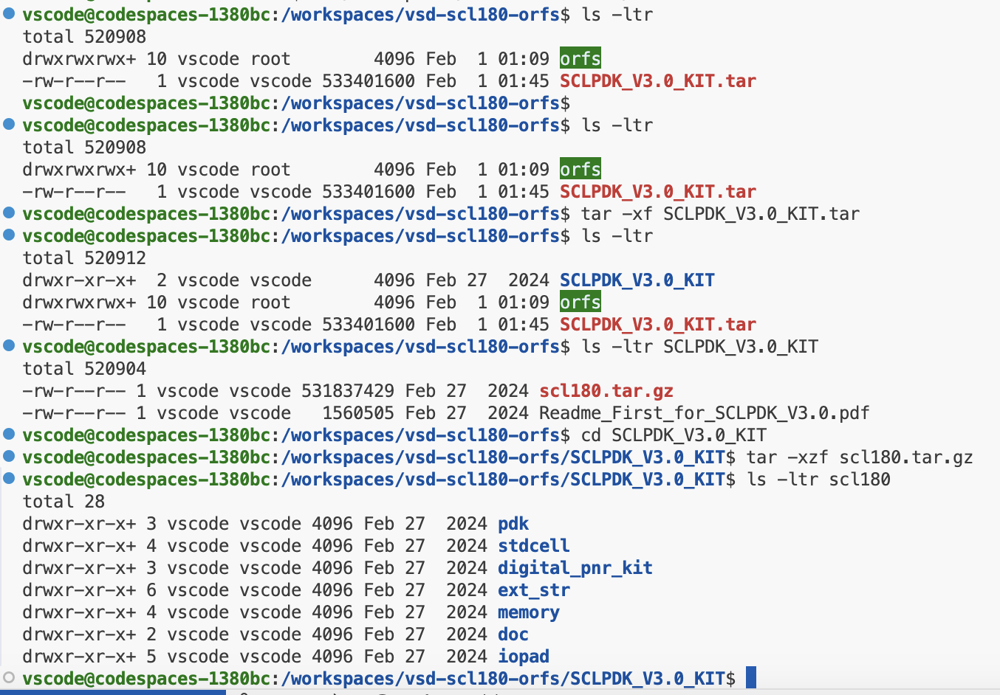

```bash
tar -xf SCLPDK_V3.0_KIT.tar
cd SCLPDK_V3.0_KIT
tar -xzf scl180.tar.gz
```

This creates:

```
scl180/
├── stdcell/
├── pdk/
├── digital_pnr_kit/
└── ...
```

---

## Step 4: Copy **Technology LEF**

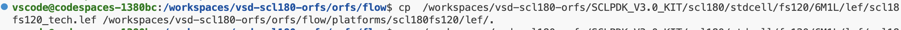

```bash
cp scl180/stdcell/fs120/6M1L/lef/scl18fs120_tech.lef \
   orfs/flow/platforms/scl180fs120/lef/
```

---

## Step 5: Copy **Standard-Cell LEF**

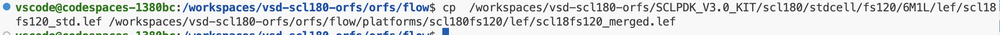

```bash
cp scl180/stdcell/fs120/6M1L/lef/scl18fs120_std.lef \
   orfs/flow/platforms/scl180fs120/lef/scl18fs120_merged.lef
```

---

## Step 6: Verify LEFs in ORFS Platform

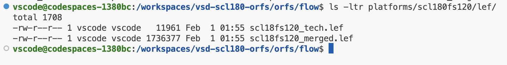

```bash
ls orfs/flow/platforms/scl180fs120/lef/
```

Expected:

```
scl18fs120_tech.lef
scl18fs120_merged.lef
```

---

## Step 7: Copy **Standard-Cell GDS**

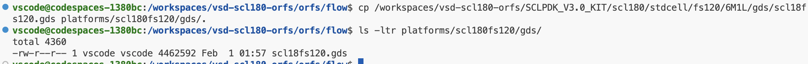

```bash
cp scl180/stdcell/fs120/6M1L/gds/scl18fs120.gds \
   orfs/flow/platforms/scl180fs120/gds/
```

---

## Step 8: Copy **Liberty (.lib)**

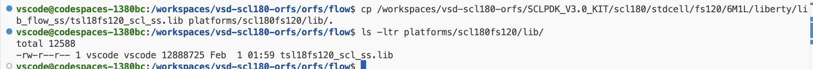

```bash
cp scl180/stdcell/fs120/6M1L/liberty/lib_flow_ss/tsl18fs120_scl_ss.lib \
   orfs/flow/platforms/scl180fs120/lib/
```

---

## Step 9: Filter `srlab` Cells (VERY IMPORTANT)

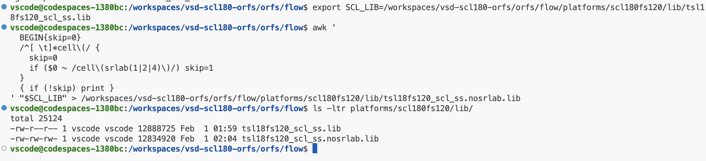

```bash
export SCL_LIB=orfs/flow/platforms/scl180fs120/lib/tsl18fs120_scl_ss.lib

awk '
BEGIN{skip=0}
/^[ \t]*cell\(/ {
  skip=0
  if ($0 ~ /cell\(srlab(1|2|4)\)/) skip=1
}
{ if (!skip) print }
' "$SCL_LIB" \
> orfs/flow/platforms/scl180fs120/lib/tsl18fs120_scl_ss.nosrlab.lib
```

---

## Step 10: Run the Flow

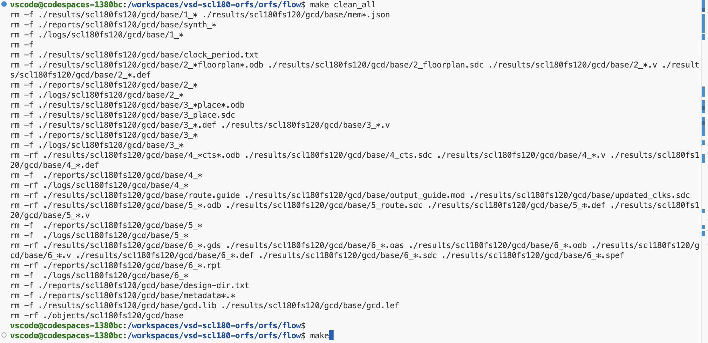

```bash
cd orfs/flow
make clean_all
make
```

---

## Step 11: Verify Completion & View Layout

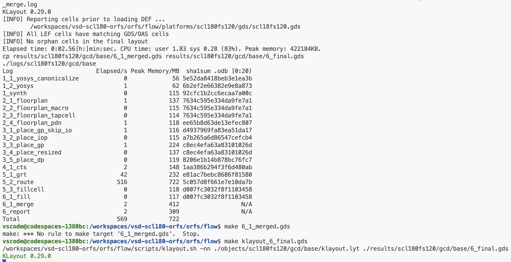

```bash
make klayout_6_final.gds
```

---

## Step 12: Access GUI via noVNC

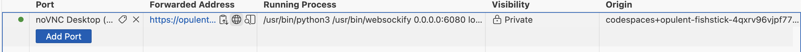

* Open **Ports** tab in Codespaces
* Click **Port 6080**
* XFCE desktop opens in browser
* KLayout launches graphically

---

### Opening the noVNC Desktop (GUI Access)

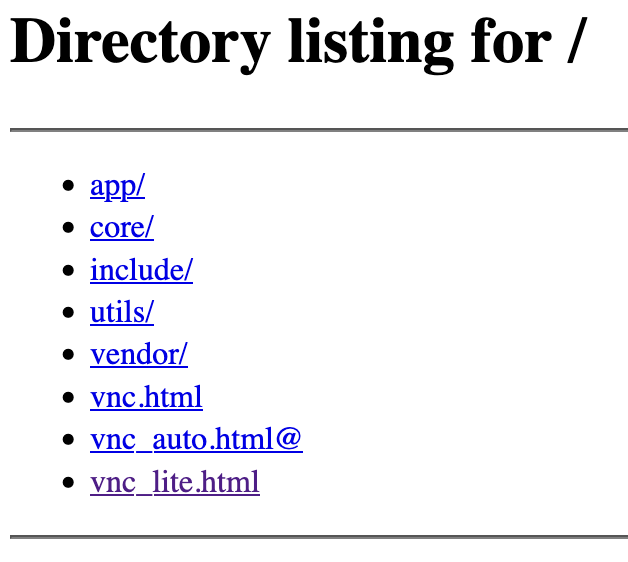

Once Port **6080** is opened in GitHub Codespaces, the noVNC web interface becomes accessible.  
This page confirms that the browser-based VNC server is running.

**Recommended action:**
- Click **`vnc_lite.html`** for a faster and lightweight desktop session.

This opens an XFCE desktop directly inside your browser, with access to graphical EDA tools such as **KLayout**, **GTKWave**, and **Magic**.

---

### Viewing the Final Layout in KLayout

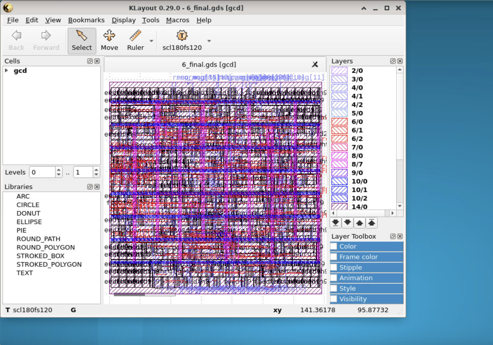


---

# 2️⃣ Running the Flow on a **Local Ubuntu Machine**

### Supported Environment

* **Ubuntu 22.04**
* **x86-64**
* No OpenROAD installation required

---

## Step 1: Clone the Repository

```bash
git clone https://github.com/vsdip/vsd-scl180-orfs.git
cd vsd-scl180-orfs
```

---

## Step 2: Use the Bundled OpenROAD Binary

Prebuilt OpenROAD location:

```
orfs/tools/openroad/bin/openroad
```

Add it to your PATH:

```bash
export PATH=$PWD/orfs/tools/openroad/bin:$PATH
openroad -version
```

---

## Step 3: Provide the SCL180 PDK

Repeat **Steps 2–9 from the Codespaces section** to populate:

```
orfs/flow/platforms/scl180fs120/
├── lef/
├── gds/
├── lib/
```

---

## Step 4: Run the Flow

```bash
cd orfs/flow
make clean_all
make
```

---

## Step 5: View Final Layout (Optional)

```bash
make klayout_6_final.gds
```

---

## Summary

* ✅ Fully open-source **RTL-to-GDS** flow
* ✅ Works on **GitHub Codespaces** and **local Ubuntu**
* ✅ No OpenROAD installation required
* ✅ Clean separation of **licensed PDK content**
* ✅ Suitable for **education, research, and prototyping**

